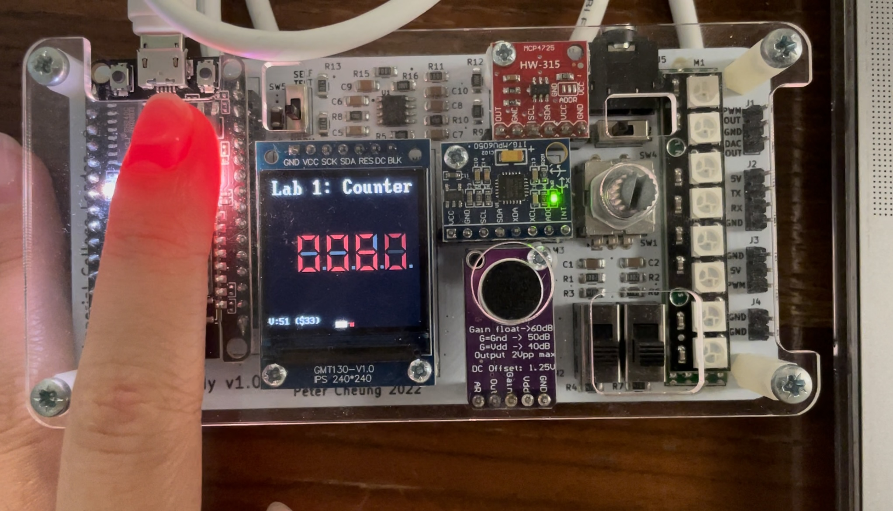
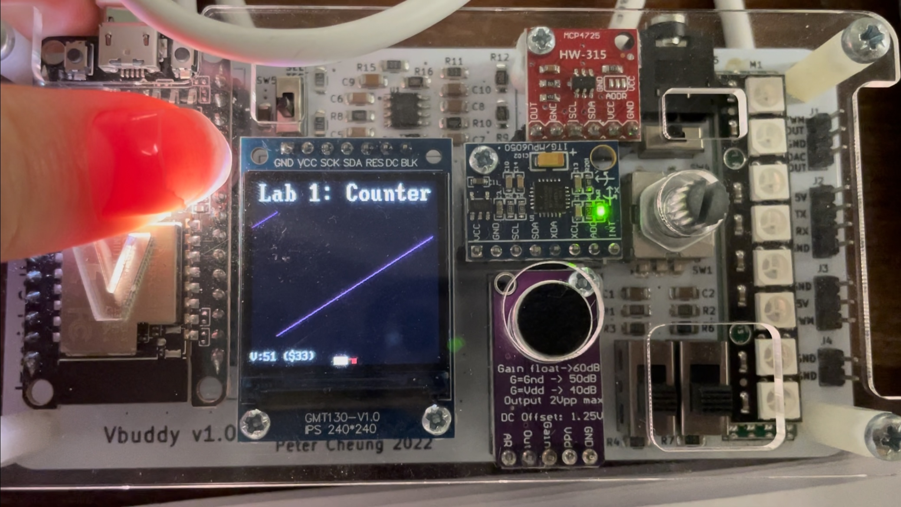

<center>

## EIE2 Instruction Set Architecture & Compiler (IAC)
---
## Lab 1 -  Log Book

---

</center>

---
## Environment Set up 
---

Fork the github repository to your github account, then clone a copy to your local disk. Follow instructions here: https://docs.github.com/en/repositories/creating-and-managing-repositories/cloning-a-repository

To compile the SV model with the testbench, run the following: 

Open a terminal window and enter the following command:

```bash
# run Verilator to translate Verilog into C++, including C++ testbench
verilator -Wall --cc --trace counter.sv --exe counter_tb.cpp
```
This runs Verilator to translate counter.sv into C++ code, and merge with **_counter_tb.cpp_** to produces a number of files in a new folder: **obj_dir**. It also automatically generates a **_.mk_** file called **_Vcounter.mk_**, which will produce the final simulation model **_Vcounter_**.

Next enter:

```bash
# build C++ project via make automatically generated by Verilator
make -j -C obj_dir/ -f Vcounter.mk Vcounter
```

This makes **_Vcounter_**, which is the executable model of our counter!  

We are now ready to simulate by simply running **_Vcounter_**, which is again in the **_obj_dir/._** directory, by entering:

```bash
# run executable simulation file
obj_dir/Vcounter
```

After creating a ./doit.sh file, we can give permission to execute using: 
```bash
chmod +x doit.sh
```

and run all the commands in one go by typing: 
```bash
./doit.sh
```

## Task 1: Simulating a basic 8-bit binary counter 
A 256 x 8bit ROM is created in the **_counter.sv** file as shown: 
```Verilog 
module counter #(
    parameter WIDTH = 8
)(
    //interface signals 
    input logic     clk,    //clk
    input logic     rst,    //reset 
    input logic     en,     //counter enable 
    output logic [WIDTH-1:0] count     /*count output [(WIDTH-1):0] creates a 8 bit output 7:0*/
);

always_ff @ (posedge clk)
    if (rst) count <= {WIDTH{1'b0}}; //this converts the 1 bit 0 to an 7 bit zero matching the WIDTH
    else     count <= count + {{WIDTH-1{1'b0}}, en}; 
endmodule

```
Then we create a **_counter_tb.cpp_** file for the testbench of the counter module. 

<p align="center">  </p>

After compiling the System Verilog model with the testbench, we obtain a vcd file. 

<p align="center">  </p>

We see that after enable goes to high, the counter starts to count up from 0, in increments of 1. 

This line of code in the counter module is responsible for the increments: 

```Verilog 
always_ff @ (posedge clk)
    if (rst) count <= {WIDTH{1'b0}}; //this converts the 1 bit 0 to an 7 bit zero matching the WIDTH
    else     count <= count + {{WIDTH-1{1'b0}}, en}; 
```
Next, we observe that the count value resets to 0 after counting to 10. This is because on the 15th clock cycle, the simulation cycle will set rst as high due to this line of code: 

```c++
    top->rst = (i < 2) | (i == 15);
```
But the (rst) value processed by the counter module is still the value of (rst) in the previous clock cycle, 0. Hence it will still increment to 0A. 

However on the 16th cycle, the counter module will take rst as high and will reset the value of count to 0. 

Why is the time axis of the vcd in ps?

I think ps is used because of how fast each clock cycle is processed. 


**Test yourself challenge 1**

Modify the testbench so that you stop counting for 3 cycles once the counter reaches 0x9, and then resume counting.  You may also need to change the stimulus for _rst_.

I changed the stimulus for rst such that it only resets when i<3. From the waveform generated, I can deduce that count reaches 0x9 when i = 13. Hence, I changed the testbench:

```cpp
if (top->count == 0x9){
            if (i < 14){
                top->en = 0;
            }
            else top->en = 1;
        }
        else top->en = 1;
```
The VCD waveform shows that the program executes as intended:
<p align="center">  </p>

Initially, I made the mistake of writing: 
```c++
if(top->count == 0x9){
    if (i < i+3) top->en = 0;
}
```

Since i will never be larger than i + 3, the waveform looked as such: 
<p align="center">  </p>

**Test yourself challenge 2**

The current counter has a synchronous reset. To implement asynchronous reset, you can change line 11 of counter.sv to detect change in _rst_ signal.  (See notes.) 

```Verilog 
module counter #(
    parameter WIDTH = 8
)(
    //interface signals 
    input logic     clk,    //clk
    input logic     rst,    //reset 
    input logic     en,     //counter enable 
    output logic [WIDTH-1:0] count     /*count output [(WIDTH-1):0] creates a 8 bit output 7:0*/
);

always_ff @ (posedge clk, posedge rst)
    if (rst) count <= {WIDTH{1'b0}}; //this converts the 1 bit 0 to an 7 bit zero matching the WIDTH
    else     count <= count + {{WIDTH-1{1'b0}}, en}; 
endmodule
```
This means that whenever the module detects that rst has gone high, it will still run the code in the always_ff loop, independent of the clock. 

I also changed the testbench to set rst -> high for clock cycles 10, 20.

<p align="center">  </p>

In the waveform generated, we can see that the value of count resets to 0 in the middle of clock cycle 11. This shows that it is asynchronously reset, as the value is changing in the middle of a clock cycle. 

I also observed that the value of count did not change immediately at the posedge of rst but rather half a cycle later. This could be due to delay in registering the posedge of rst, hence causing output to still be 0x5 for half a cycle.

## Task 2: Linking Verilator simulation with VBuddy

After every new connection:

 Find the name of the USB device used, using this command in terminal:

```bash
ls /dev/tty.u*
```

Then, create a file vbuddy.cfg which contains the terminal response. 

**Step 2**

The testbench was given for this step. A new function I learnt was how to display hex values on the TFT screen. It is as followed:
```C++
       ++++ Send count value to Vbuddy
        vbdHex(4, (int(top->count) >> 12) & 0xF);
        vbdHex(3, (int(top->count) >> 8) & 0xF);
        vbdHex(2, (int(top->count) >> 4) & 0xF);
        vbdHex(1, int(top->count) &0xF);
        ---- end of Vbuddy output section
```
Taking the first line for example, 4 means to display it on the 4th hex display from the right, and ">> 12" means to right shift the value by 12 bits such that the 4 MSB can be anded with 0xF, displaying the value of the 4 MSB. 


Recompiling the testbench, we see that the screen displays the count value and counts up from 0000.

<p align="center">  </p>


**Step 3**

I added a line in the testbench: 
```C++
    top->en = vbdFlag();
```
Which sets the value of en to be controlled by vbdFlag. We can make en = 0 when the flag is down, and en = 1 when the flag is up by pressing the rotary button. 

To plot the value on the TFT, I added another line to the testbench, and commented out the vbdHex() display commands.

```C++
    vbdPlot(int(top->count), 0, 255);
```

This showed a straight line with a positive gradient.

<p align="center">  </p>

**Test Yourself Challenge**

Modify your counter and testbench files so that the **_en_** signal controls the direction of counting: ‘1’ for up and ‘0’ for down, via the **_vbdFlag()_** function.

To do so, I changed the *_counter.sv_* file. 

When en is high, we should add 1 to the current count.

 When en is low, we should minus 1 from the current count. We can do minus by adding {WIDTH-1{1'b1}} to the current count. 

 This is the updated counter.sv file:
 ```Verilog 
always_ff @ (posedge clk)
    if (rst) count <= {WIDTH{1'b0}}; //this converts the 1 bit 0 to an 7 bit zero matching the WIDTH
    else if (en) count <= count + {{WIDTH-1{0'b1}}, en};
    else count <= count + {WIDTH-1{1'b1}};
 ```
 
 <p align="center">  </p>

 We see the TFT screen showing the plot of COUNT, and when the rotary button is pressed en is high, allowing count to start counting up. 


